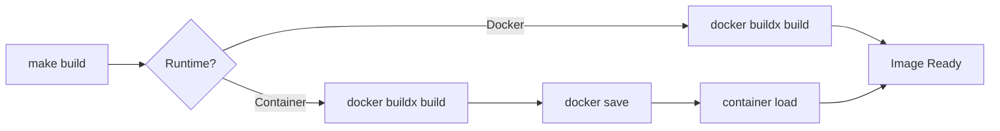

# Developer Guide - Ceph Automation Suite

## 📚 목차

- [아키텍처 개요](#아키텍처-개요)
- [기술 스택](#기술-스택)
- [Docker 이미지 최적화](#docker-이미지-최적화)
- [빌드 시스템](#빌드-시스템)
- [버전 관리 시스템](#버전-관리-시스템)
- [macOS Container Runtime 통합](#macos-container-runtime-통합)
- [개발 팁과 모범 사례](#개발-팁과-모범-사례)

## 아키텍처 개요

### 프로젝트 설계 원칙

1. **컨테이너화**: 모든 의존성을 Docker 이미지에 포함
2. **모듈화**: Ansible 플레이북을 목적별로 분리
3. **자동화**: Makefile을 통한 모든 작업 자동화
4. **호환성**: Docker와 macOS Container Runtime 모두 지원

### 컴포넌트 구조

```
┌─────────────────────────────────────────────────┐
│              Makefile (Orchestrator)             │
├─────────────────────────────────────────────────┤
│                Build System                      │
│  ┌──────────┐  ┌──────────┐  ┌──────────────┐  │
│  │ Docker   │  │   UV     │  │  Container   │  │
│  │ Buildx   │  │ Package  │  │   Runtime    │  │
│  └──────────┘  └──────────┘  └──────────────┘  │
├─────────────────────────────────────────────────┤
│              Application Layer                   │
│  ┌──────────────────────────────────────────┐  │
│  │         Ansible Playbooks                 │  │
│  │  ┌──────────┐  ┌──────────┐  ┌────────┐ │  │
│  │  │Deployment│  │ Services │  │  Ops   │ │  │
│  │  └──────────┘  └──────────┘  └────────┘ │  │
│  └──────────────────────────────────────────┘  │
├─────────────────────────────────────────────────┤
│              Runtime Environment                 │
│  ┌──────────┐  ┌──────────────────────────┐   │
│  │  Alpine  │  │   cephadm-ansible        │   │
│  │  Linux   │  │   (embedded)             │   │
│  └──────────┘  └──────────────────────────┘   │
└─────────────────────────────────────────────────┘
```

## 기술 스택

### Core Technologies

| 컴포넌트 | 기술 | 버전 | 용도 |
|----------|------|------|------|
| Base OS | Alpine Linux | 3.19 | 컨테이너 베이스 이미지 |
| Runtime | Python | 3.11 | Ansible 실행 환경 |
| Package Manager | UV/UVX | latest | Python 패키지 관리 |
| Configuration Management | Ansible | 2.11+ | 자동화 엔진 |
| Ceph Deployment | cephadm-ansible | 3.1.0 | Ceph 클러스터 배포 |
| Build Tool | Docker Buildx | latest | 멀티 플랫폼 빌드 |
| Container Runtime | Docker/Container | latest | 컨테이너 실행 |

### 의존성 구조

```python
# pyproject.toml 핵심 의존성
dependencies = [
    "ansible>=2.11",          # Ansible 자동화 엔진
    "jinja2>=3.0",            # 템플릿 엔진
    "pyyaml>=6.0",            # YAML 파싱
    "netaddr>=0.8",           # 네트워크 주소 처리
    "cryptography>=40.0",     # 암호화 라이브러리
]
```

## Docker 이미지 최적화

### Multi-Stage Build 전략

```dockerfile
# Stage 1: UV 설치 및 Python 의존성 빌드
FROM python:3.11-alpine AS uv-builder
# UV를 사용한 효율적인 의존성 설치

# Stage 2: cephadm-ansible 클론
FROM alpine:3.19 AS cephadm-builder
# Git을 사용한 최소 클론

# Stage 3: 최종 런타임 이미지
FROM python:3.11-alpine
# 최적화된 런타임 환경 구성
```

### 이미지 크기 최적화 기법

1. **Alpine Linux 사용**: 기본 이미지 크기 최소화
2. **Multi-stage Build**: 빌드 도구를 최종 이미지에서 제외
3. **캐시 제거**: Python 캐시 및 불필요한 파일 삭제
4. **레이어 최적화**: RUN 명령 통합으로 레이어 수 감소

**결과**: 825MB → 645MB (22% 감소)

### 빌드 최적화

```bash
# 빌드 캐시 활용
make build-cache

# 특정 플랫폼용 빌드
docker buildx build --platform linux/amd64 -t ceph-automation-suite:latest .
```

## 빌드 시스템

### Makefile 아키텍처

```makefile
# 1. 변수 정의
VERSION := $(shell cat VERSION)
CONTAINER_RUNTIME := $(shell ...)

# 2. 타겟 정의
target: dependencies
    @command

# 3. 조건부 로직
ifeq ($(CONTAINER_RUNTIME),container)
    # macOS Container 전용 로직
else
    # Docker 전용 로직
endif
```

### 빌드 워크플로우



### 주요 Make 패턴

```makefile
# 1. Phony 타겟 (파일이 아닌 명령)
.PHONY: build run test

# 2. 변수 사용
VERSION := $(shell cat VERSION)
build:
    @docker build --build-arg VERSION=$(VERSION) .

# 3. 의존성 체인
release-patch: bump-patch
    @git add -A
    @git commit -m "chore: bump version"

# 4. 조건부 실행
ifdef CONTAINER_COMPOSE_EXISTS
    @$(COMPOSE_CMD) up -d
endif
```

## 버전 관리 시스템

### VERSION 파일 중심 아키텍처

```
VERSION (Single Source of Truth)
    ├── pyproject.toml (Python package version)
    ├── Dockerfile (ARG VERSION, LABEL version)
    └── README.md (Documentation version)
```

### 버전 업데이트 스크립트

```bash
# scripts/bump-version.sh
IFS='.' read -r MAJOR MINOR PATCH <<< "$CURRENT_VERSION"

case "$1" in
    major) MAJOR=$((MAJOR + 1)); MINOR=0; PATCH=0 ;;
    minor) MINOR=$((MINOR + 1)); PATCH=0 ;;
    patch) PATCH=$((PATCH + 1)) ;;
esac
```

### Semantic Versioning

- **MAJOR**: 호환성이 깨지는 변경
- **MINOR**: 하위 호환 기능 추가
- **PATCH**: 하위 호환 버그 수정

## macOS Container Runtime 통합

### Container Runtime vs Docker

| 특성 | Docker | macOS Container |
|------|--------|----------------|
| 기반 기술 | Linux VM | Virtualization.framework |
| 성능 | 표준 | 네이티브 (더 빠름) |
| 리소스 사용 | 높음 | 낮음 |
| 호환성 | 100% | 제한적 |

### Container-Compose 통합

```yaml
# container-compose.yml
version: '3.8'
services:
  ceph-automation:
    image: docker.io/library/ceph-automation-suite:latest
    volumes:
      - ./inventory:/opt/ceph-automation/inventory
      - ~/.ssh:/home/ansible/.ssh:ro
```

### 런타임 감지 로직

```makefile
CONTAINER_CHECK := $(shell command -v container 2>/dev/null)
ifdef CONTAINER_CHECK
    CONTAINER_RUNTIME := container
else
    CONTAINER_RUNTIME := docker
endif
```

## 개발 팁과 모범 사례

### 1. 효율적인 개발 사이클

```bash
# 빠른 반복 개발
make build-cache  # 캐시 활용
make run         # 대화형 테스트
make shell       # 실행 중인 컨테이너 접속
```

### 2. 디버깅 팁

```bash
# Ansible 디버깅
ANSIBLE_VERBOSITY=4 ansible-playbook playbook.yml

# Docker 빌드 디버깅
docker buildx build --progress=plain .

# 컨테이너 로그 확인
docker logs -f container-name
```

### 3. 성능 최적화

```yaml
# ansible.cfg 최적화
[defaults]
gathering = smart
fact_caching = jsonfile
fact_caching_timeout = 86400
pipelining = True
```

### 4. 보안 고려사항

```dockerfile
# 비루트 사용자 실행
USER ansible

# 민감 정보 마운트
volumes:
  - ~/.ssh:/home/ansible/.ssh:ro  # 읽기 전용
```

### 5. CI/CD 통합

```yaml
# GitHub Actions 예시
name: Build and Test
on: [push, pull_request]
jobs:
  build:
    runs-on: ubuntu-latest
    steps:
      - uses: actions/checkout@v3
      - name: Build Docker image
        run: make build
      - name: Run tests
        run: make test
```

### 6. 트러블슈팅

**일반적인 문제와 해결책:**

| 문제 | 원인 | 해결책 |
|------|------|--------|
| 빌드 실패 | 캐시 충돌 | `docker buildx prune` |
| UV 설치 실패 | 네트워크 문제 | 프록시 설정 확인 |
| Container 런타임 에러 | 권한 문제 | `sudo` 또는 권한 확인 |
| Ansible 연결 실패 | SSH 키 문제 | `.ssh` 디렉토리 권한 확인 |

### 7. 개발 환경 커스터마이징

```bash
# .env.local (gitignore에 추가)
export ANSIBLE_HOST_KEY_CHECKING=False
export ANSIBLE_RETRY_FILES_ENABLED=False
export PYTHONUNBUFFERED=1
```

### 8. 테스트 전략

```bash
# 단위 테스트
make test

# 통합 테스트
make validate

# 성능 테스트
time make build
docker stats
```

## 다음 단계

- [CONTRIBUTING.md](../CONTRIBUTING.md) - 기여 가이드라인
- [README.md](../README.md) - 프로젝트 개요
- [CHANGELOG.md](../CHANGELOG.md) - 버전 히스토리

## 참고 자료

- [Ansible Documentation](https://docs.ansible.com/)
- [Ceph Documentation](https://docs.ceph.com/)
- [Docker Best Practices](https://docs.docker.com/develop/dev-best-practices/)
- [Alpine Linux](https://alpinelinux.org/)
- [UV Package Manager](https://github.com/astral-sh/uv)