# Ceph Architecture

Ceph 공식 문서 기반 상세 아키텍처 가이드

## 📊 아키텍처 개요

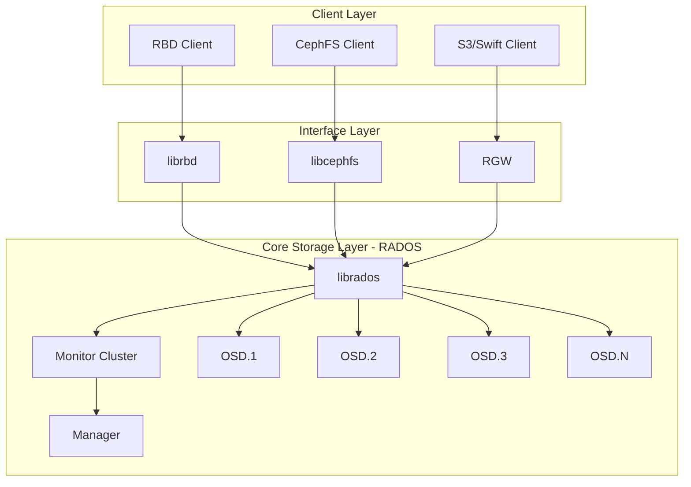

## 🔧 계층별 상세 아키텍처

### 1. 클라이언트 계층 (Client Layer)

클라이언트는 Ceph 클러스터와 상호작용하는 애플리케이션 및 사용자입니다.

#### 클라이언트 타입

- **Thick Clients**: librados를 직접 사용 (RBD, CephFS)
- **Thin Clients**: HTTP/S3 프로토콜 사용 (RGW)
- **Kernel Clients**: 커널 모듈 통합 (krbd, kcephfs)

#### 클라이언트 아키텍처

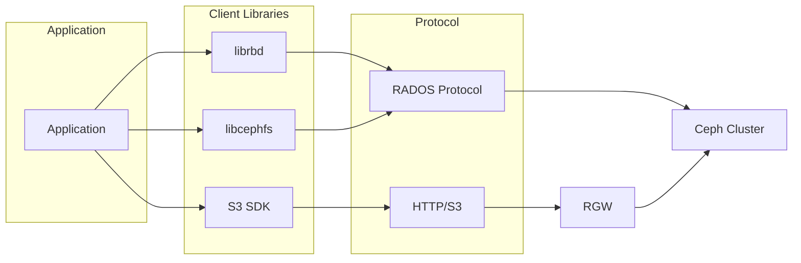

### 2. RADOS 계층 (Core Storage)

RADOS는 Ceph의 핵심 객체 스토리지 시스템입니다.

#### RADOS 구성 요소

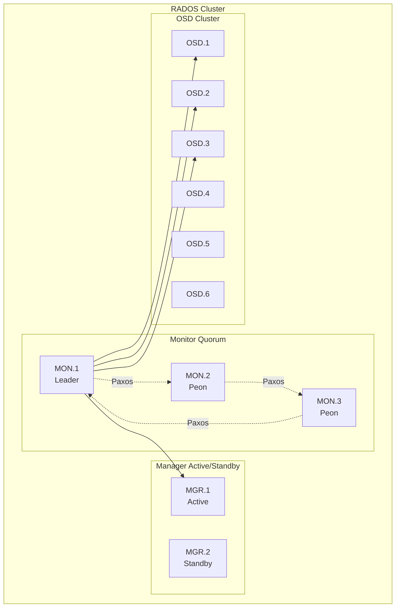

### 3. 데이터 플로우 아키텍처

#### 쓰기 작업 플로우

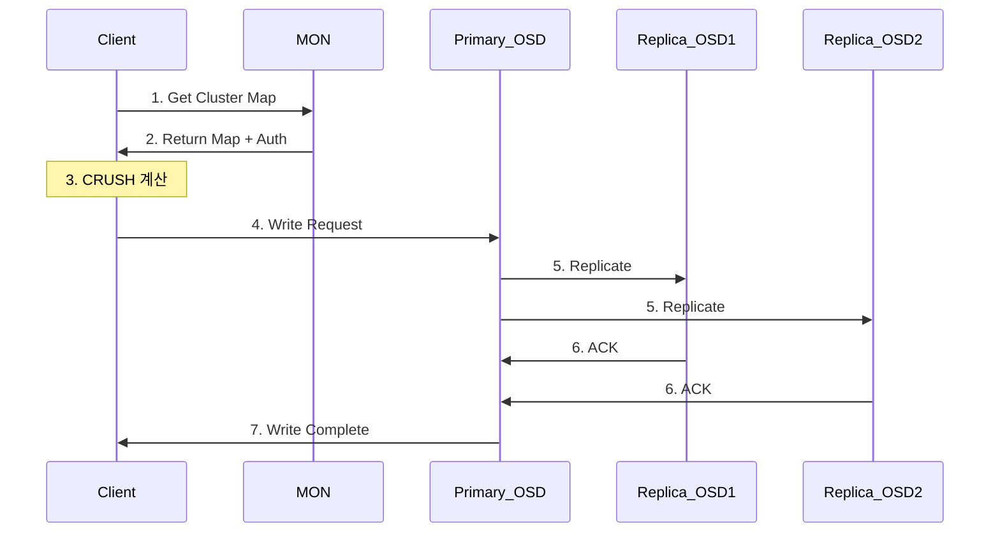

#### 읽기 작업 플로우

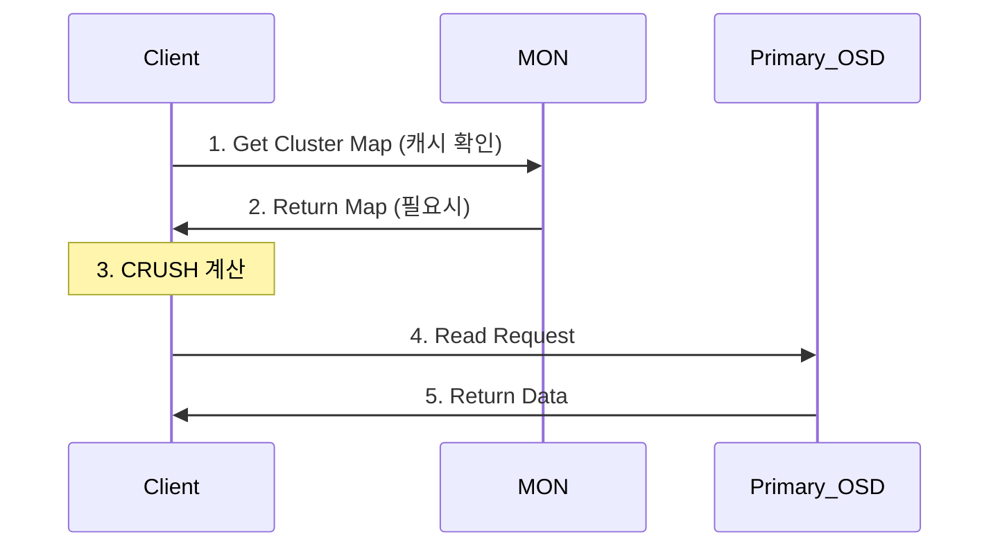

## 🗺️ CRUSH 맵 구조

### CRUSH 계층 구조

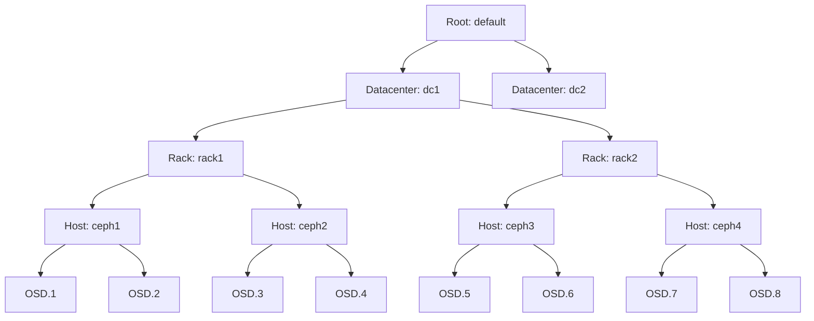

### CRUSH 알고리즘 플로우

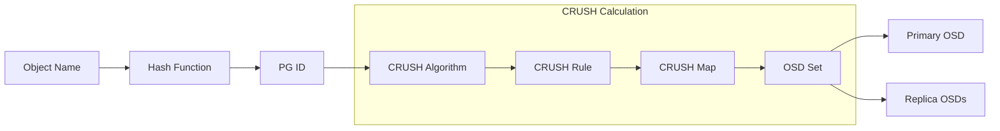

## 📁 스토리지 서비스 아키텍처

### RBD (Block Storage)

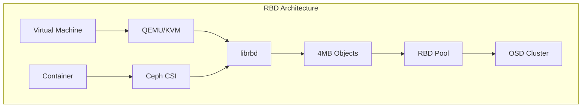

**RBD 특징:**
- 블록 디바이스 추상화
- 씬 프로비저닝
- 스냅샷 및 클론
- 이미지 레이어링

### CephFS (File System)

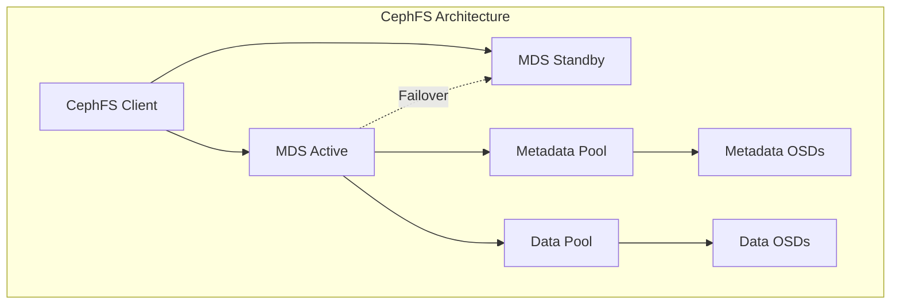

**CephFS 구성 요소:**
- **MDS**: 메타데이터 서버
- **Metadata Pool**: 파일 시스템 메타데이터
- **Data Pool**: 실제 파일 데이터

### RGW (Object Storage)

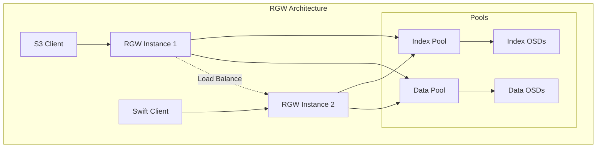

## 🔄 Placement Group (PG) 아키텍처

### PG 매핑 구조

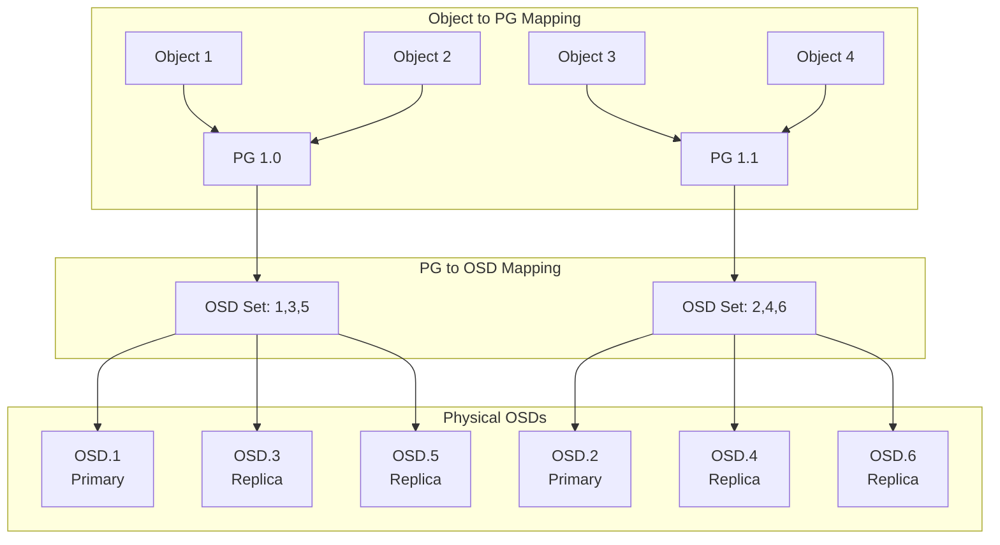

### PG 상태 머신

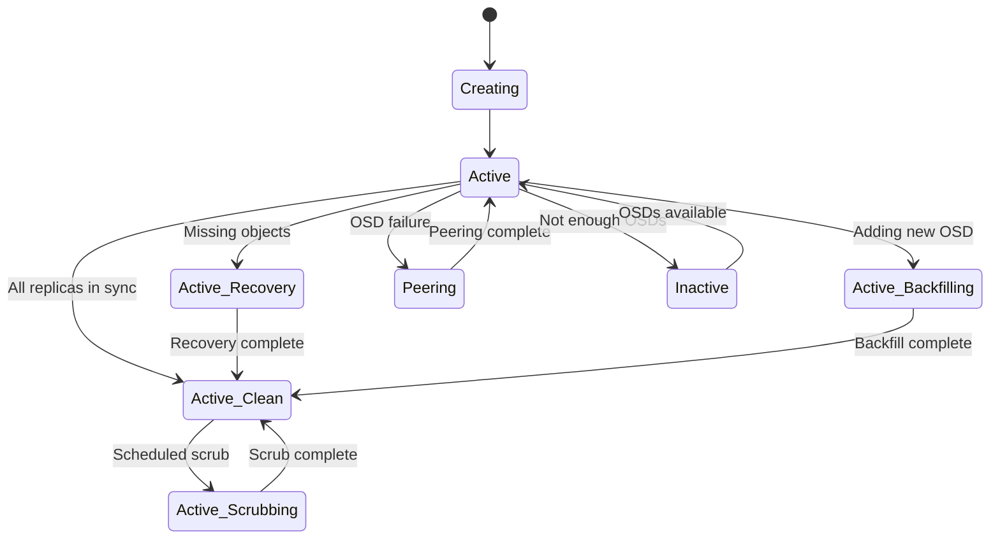

## 🔐 인증 및 보안 아키텍처

### CephX 인증 플로우

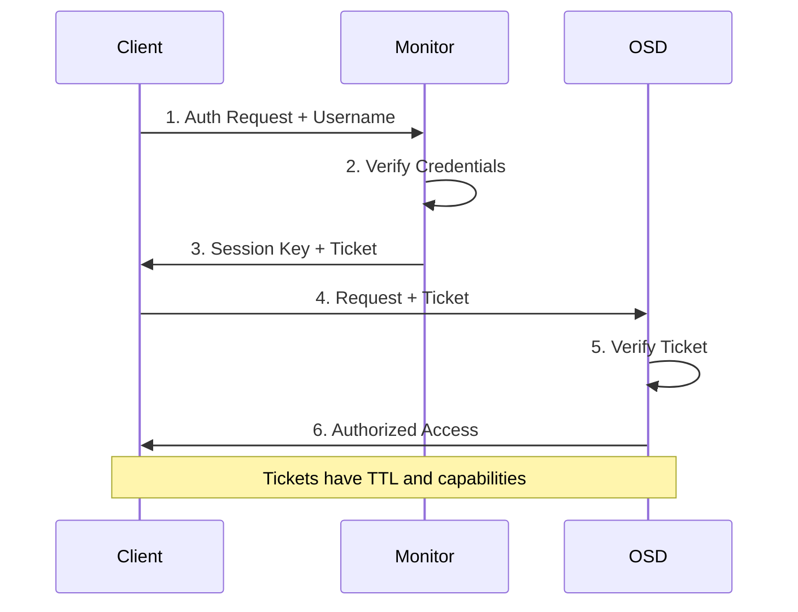

### 보안 계층

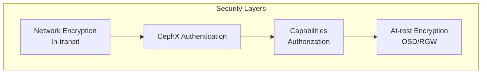

## 🚀 고가용성 아키텍처

### Monitor Quorum

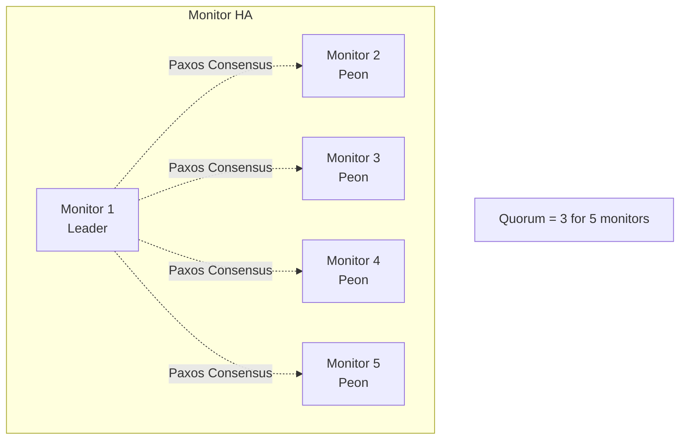

### 장애 도메인

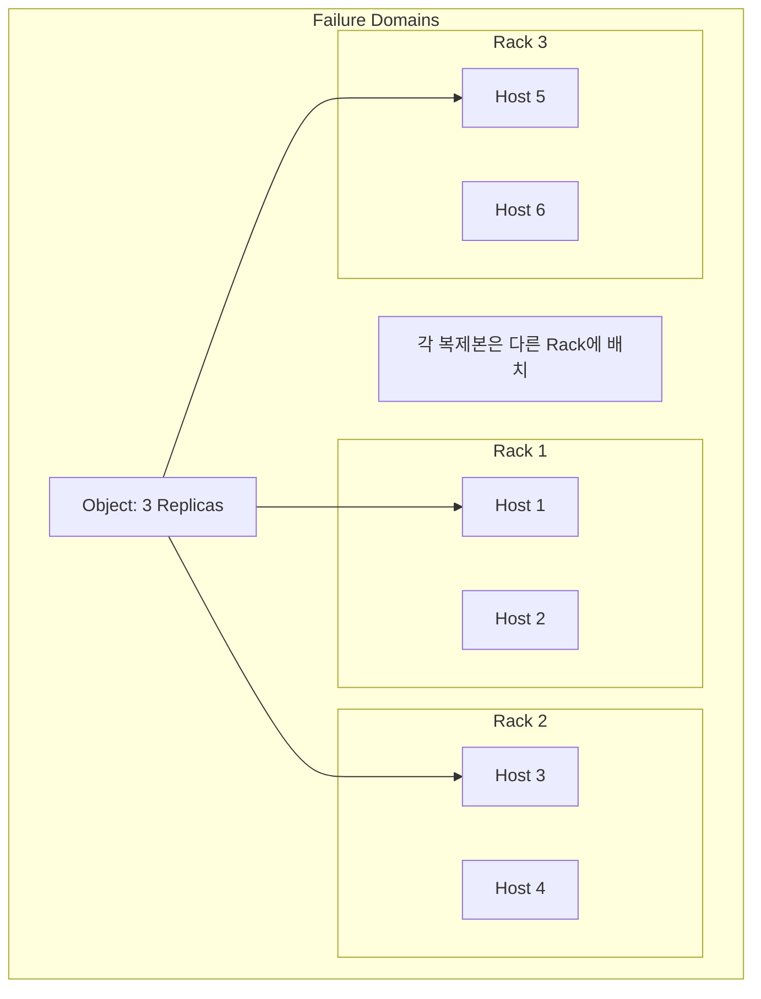

## 📈 확장성 아키텍처

### 수평 확장

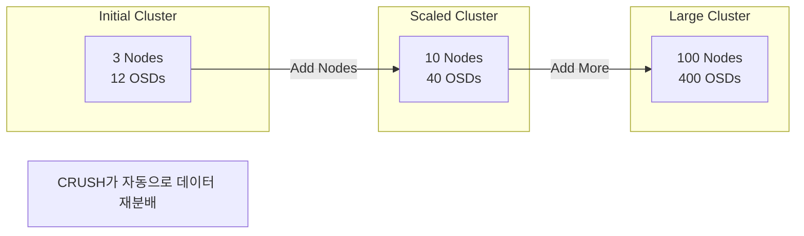

### 성능 확장

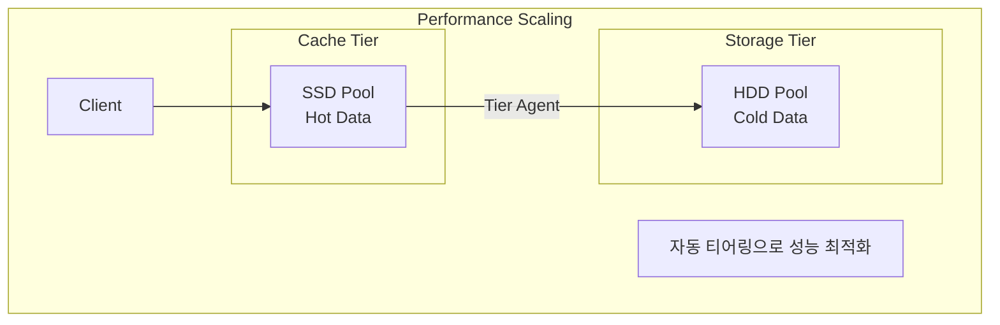

## 🔧 BlueStore 아키텍처

### BlueStore 스택

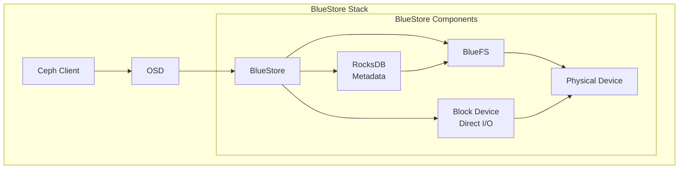

### BlueStore 특징

- **직접 블록 접근**: 파일 시스템 오버헤드 제거
- **효율적 메타데이터**: RocksDB 사용
- **체크섬**: 데이터 무결성
- **압축**: 인라인 압축 지원
- **효율적 오버라이트**: Copy-on-Write 최소화

## 📊 모니터링 아키텍처

### 모니터링 스택

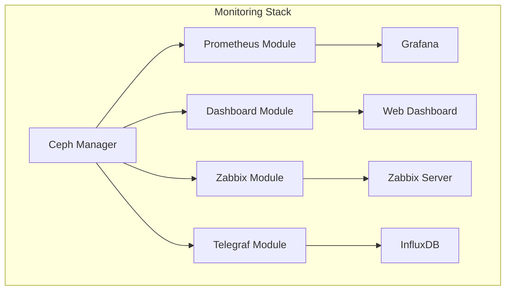

## 🌐 네트워크 아키텍처

### 듀얼 네트워크 구성

```mermaid
graph TB
    subgraph "Network Architecture"
        subgraph "Public Network"
            Client[Clients]
            MON[Monitors]
            MGR[Managers]
            RGW[RGW]
        end

        subgraph "Cluster Network"
            OSD1[OSD 1]
            OSD2[OSD 2]
            OSD3[OSD 3]
            OSDN[OSD N]
        end

        Client -.->|Client Traffic| OSD1
        MON -.->|Monitor Traffic| OSD1

        OSD1 <-->|Replication| OSD2
        OSD2 <-->|Recovery| OSD3
        OSD3 <-->|Backfill| OSDN
    end

    Note1[Public: 10.10.2.0/24]
    Note2[Cluster: 192.168.2.0/24]
```

## 요약

Ceph 아키텍처는 RADOS를 중심으로 한 분산 객체 스토리지 시스템으로, CRUSH 알고리즘을 통해 데이터를 지능적으로 분산하고, 다양한 스토리지 인터페이스(RBD, CephFS, RGW)를 제공합니다. Monitor 쿼럼은 클러스터 상태를 관리하고, OSD는 실제 데이터를 저장하며, Manager는 모니터링과 오케스트레이션을 담당합니다. 이 모든 구성 요소가 협력하여 확장 가능하고 자가 치유가 가능한 스토리지 플랫폼을 구성합니다.

---

*이 문서는 Ceph 공식 문서(docs.ceph.com) 및 Red Hat Ceph Storage 아키텍처 가이드를 기반으로 작성되었습니다.*